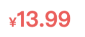

# wxml-to-canvas 最佳实践 [代码片段](https://developers.weixin.qq.com/s/FL8agRmX7GT9)

[代码片段](https://developers.weixin.qq.com/s/FL8agRmX7GT9) 可直接预览本项目代码


 - Q: `wxml-to-canvas`是什么？<br/>
 - A: 小程序内通过**静态模板**和**样式**绘制 `canvas` ，导出图片，可用于生成分享图等场景。<br/>
       官方文档：https://developers.weixin.qq.com/miniprogram/dev/platform-capabilities/extended/component-plus/wxml-to-canvas.html
       <br/>其实底层还是基于canvas进行绘制，只是做了一层语法糖。

## 前言

1. `<text></text>`必须要有height属性，width属性不是必须了 [Pull Request: https://github.com/1uokun/wxml-to-canvas/pull/1]

### 与 wxss 存在的差异

view默认弹性布局（flex），但是：

 1. 文本不能写在`<view></view>`里，必须用`<text></text>`包裹。
 2. 不支持自动撑开高度，必须给一个`height`属性；高度尽量给多，**不然差 1px 整个就都不会显示**。
 3. 父级水平布局(`flexDirection:row`)时，`<text>`必须要有一个`width`属性，且值小于父级的宽度。
 4. `text-align`必须有`width`属性才生效
 5. `vertical-align`必须有`height`属性才生效

背景&图片：

 4. 只支持`backgroundColor`，不支持`backgroundImage`。

    > _拓展：PC 端的`html2canvas`支持背景图，但是会导致图片模糊_

 5. `<image>`的`src`必须是[“合法”](https://developers.weixin.qq.com/miniprogram/dev/framework/ability/network.html)的 HTTPS 链接才能渲染，否则报错会导致整个 canvas 无法渲染。
    > _否则报错：`不在以下 downloadFile 合法域名列表中`_

其他：

 6. 样式`class`只能一个，不支持多个。
 7. 组件不能放在 `wx:if` 以内，必须始终保持已渲染状态(可以通过绝对定位进行隐藏)。
    > 否则会报错：
    > <br/>_`"canvasToTempFilePath:fail Failed to execute 'drawImage' on 'CanvasRenderingContext2D': The image argument is a canvas element with a width or height of 0."`_

### 建议文件结构

 1. 将需要绘制的`canvas`封装成一个组件，如`<share-canvas>`

    ```bash
    #component/share-canvas
     - /components
      - /share-canvas
       - index.js
       - index.json
       - index.wxml
       - index.wxss
       - poster.js
       - style.js
    #page
     - index.js
     - index.json
     - index.wxml
     - index.wxss
    ```

 2. 本质上，`renderToCanvas({wxml, style}): Promise` 获取的`wxml`和`style`都是**字符串**，而非`index.wxml`和`index.wxss`文件。

    因此 wxml 模板写在`poster.js`文件内,样式写在`style.js`内：

    ```js
    import { getWxml, getStyle } from "./poster";
    ```

 3. `canvas`的特点就是不能用动态布局，**即每一个区块都必须确定宽高** 🚩🚩🚩

    所以`<share-canvas>`内的`index.wxml`除了引入`<wxml-to-canvas>`组件之外，
    <br/>还需要承担 **预渲染动态 DOM 后获取实得尺寸** 的职能。

    ```html
    <view class="hidden">
      <wxml-to-canvas class="canvas-widget" />
      <view class="dynamic"> ... </view>
    </view>
    ```

## 实施过程

> 以 “美团优选 明日达超市” 小程序分享电商商品卡片图为例


<br/>


要实现"¥13.99"水平布局

```js
// poster.js
const getWxml = ({commodity}) => {
  return `
    <view class="price">
      <text class="y">¥</text>
      <text class="num">${commodity.price}</text>
    </view>
  `
}
```

```js
// style.js
export const getStyle = () => ({
  price: {
    width: "199rpx",
    height: "80rpx",
    display: "flex",
    flexDirection: "row",
    alignItems: "center"
  },
  y: {
    color: "#FD5155",
    fontSize: "24rpx",
    fontWeight: "bold"
  },
  num: {
    color: "#FD5155",
    fontSize: "40rpx",
    fontWeight: "bold"
  }
})
```

如果在wxml中一般是能正常显示出来，
但是在 canvas 环境下却无法渲染，有几个问题：

1. `<text>`必须设置高度`height`
2. 水平布局下`<text>`必须设置宽度`width`
   ```diff
   export const getStyle = () => ({
     ...
     y: {
   +    width: "20rpx",
   +    height: "80rpx",
   +    lineHeight: "80rpx",
       color: "#FD5155",
       fontSize: "24rpx",
       fontWeight: "bold"
     },
     num: {
   +    width: "20rpx",
   +    height: "80rpx",
   +    lineHeight: "80rpx",
       color: "#FD5155",
       fontSize: "40rpx",
       fontWeight: "bold"
     }
   })
   ```

3. 符号"¥"固定宽度是没问题的；
   <br/>但是"13.99"金额是动态的，如果金额变成"999.99"，默认给的100rpx宽度可能就不够了；
   <br/>所以需要预渲染计算出宽度，再赋值到"num.width"

   ```html
   <!-- share-canvas/index.wxml -->
   <view class="hidden">
     <wxml-to-canvas class="canvas-widget" />
     <!-- 预渲染 -->
     <text class="num">{{commodity.price}}</text>
   </view>
   ```

   ```js
   // share-canvas/index.js
   
   const getPriceWidth() {
     return new Promise((resolve) => {
       wx.nextTick(() => {
         const query = this.createSelectorQuery();
         query.select(".num").boundingClientRect();
         query.exec((res) => {
           // 获取price宽度
           const width = res[0].width;
           resolve(width);
         });
       });
     });
   }
   
   getStyle({ priceWidth: await getPriceWidth() })
   ```
   ```diff
   - export const getStyle = () => ({
   + export const getStyle = ({priceWidth}) => ({
     ...
     num: {
   +    width: priceWidth,
       height: "80rpx",
       lineHeight: "80rpx",
       color: "#FD5155",
       fontSize: "40rpx",
       fontWeight: "bold"
     }
   })
   ```

> 以上为伪代码，具体参考 `/share-canvas` 组件内部实现.
